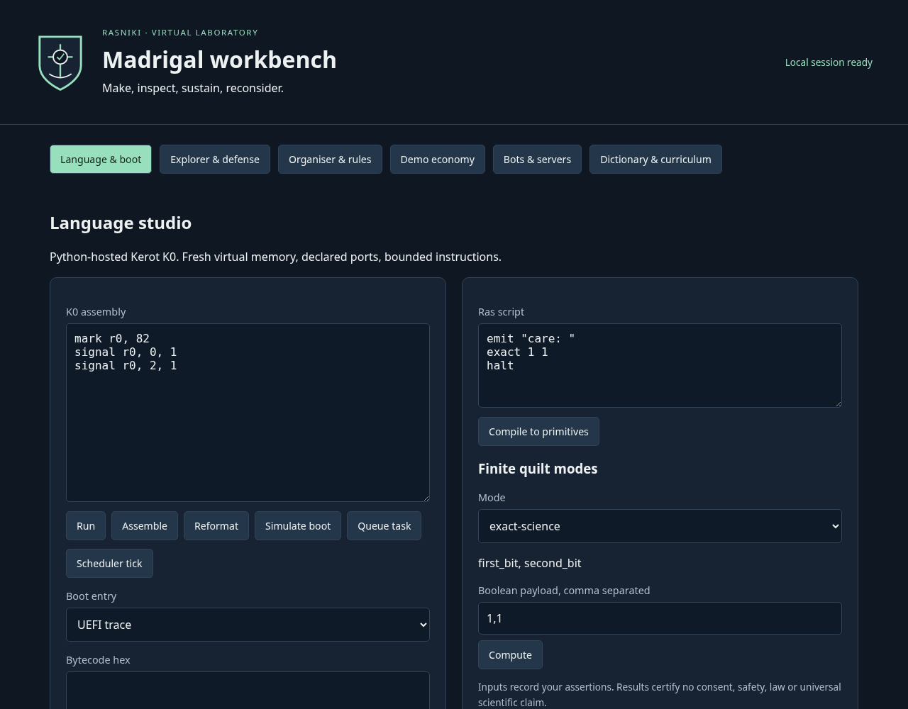

# basicest-rasniki-contractual-for-ransiki-to-ield-to-contract-writers.
basicest rasniki contractual for ransiki to ield to contract writers. oligarhy aka wolf children quality all u aneed write is thisf ro coampnies and or leagues.


## Published editions

- [Monarchic Charter](Rasniki-Monarchic-Charter.md): the full prose rendering of the supplied governance specification.
- [Science Edition 2](Rasniki-Science-Edition.md): six prose stanzas covering the hierarchy, evidence, formation, reformation, franchise and refranchise procedures.
- [Hierarchy specification](Rasniki-Science-Hierarchy.json): the compact sixteen-level model, with 1,073,741,824 potential terminal ops per formal stanza and zero generated terminal records.
- [Release record](Rasniki-Science-Release.md): revision scope and publication context.

The governance and franchise provisions are proposals; publication does not execute a trust or grant operating rights.


## Runnable Rasniki Madrigal lab

The [implementation contract](docs/IMPLEMENTATION.md) describes the language tools, simulated boot/kernel, local desktop, Guardian observations, demo economy, bots, organiser, glossary and curriculum. The full bundled Rasnikism collection is included with its [source provenance](docs/PROVENANCE.md).

```sh
python3 -m unittest discover -s tests -v
python3 -m madrigal_lab --port 8765
```

Python 3.10+ runs the local desktop. Node.js runs the upstream JavaScript checks; no third-party packages are required. State is retained under ignored `.lab-state/`. The service binds only to loopback and stops with Ctrl+C.

Boot, UEFI, the OS kernel and DEMO_CREDIT mint are declared simulations. Guardian observes file indicators; it does not prevent or remove malware. The [derivative manifest](docs/franchise-manifest.json) records the proposed franchise framework without granting operating rights. Undefined author-supplied terms remain pending definitions.


[Validation results](docs/VALIDATION.md) record the executed checks and remaining boundaries.


